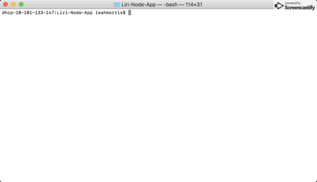
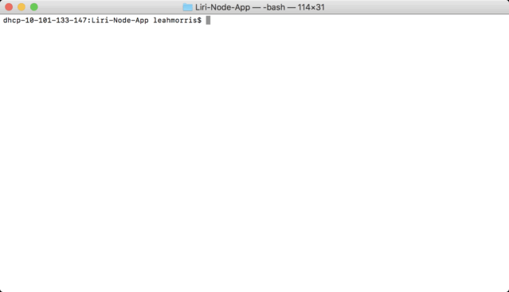
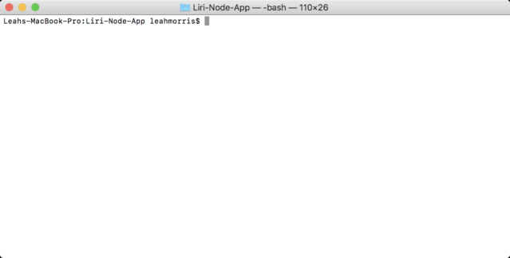

# Liri-Node-App
LIRI is a command line node app that searches Spotify for songs, Bands in Town for concerts, and OMDB for movies and returns information back based on search 

## How to Install & Use On Your Own Local Computer
1. Create a new GitHub repository 
2. Clone this repository onto your own local computer
3. In terminal, navigate to the root of your project and run a general `npm install` to install the necessary node packages listed below for this app to work, all of which are saved within my `package-lock.json` to make it an easy install for you!

    * <a href="https://www.npmjs.com/package/node-spotify-api" target="_blank">Node-Spotify-API</a>
        * **NOTE:** The Spotify API will require your own **client id** and a **client secret** code (see below for more detailed instructions)
    * <a href="https://www.npmjs.com/package/moment" target="_blank">Moment</a>
    * <a href="https://www.npmjs.com/package/dotenv" target="_blank">DotEnv</a>
    * <a href="https://www.npmjs.com/package/axios" target="_blank">Axios</a>
        * You will utilize the <a href="http://www.omdbapi.com/" target="_blank">OMDB API </a> and the <a href="http://www.artists.bandsintown.com/bandsintown-api" target="_blank">Bands In Town API</a>
4. Create a `.gitignore` file and add the following lines to that file -- this will prevent Git from tracking/committing the following files:
```
node_modules
.DS_Store
.env
```
5. Create your own `.env` file and add the following, replacing the values with your client id and a client secret code (no quotes) once you obtain them:
```js
# Spotify API keys

SPOTIFY_ID=your-spotify-id
SPOTIFY_SECRET=your-spotify-secret

```
## How To Obtain Your Own Necessary Spotify API Credentials: 
1. Visit <https://developer.spotify.com/my-applications/#!/>
2. Log in to either an existing Spotify account or create a new one (a free account is fine) and log in.
3. Once logged in, navigate to <https://developer.spotify.com/my-applications/#!/applications/create> to register for a new application to be used with the Spotify API. 
4. On the next screen, copy the corresponding values into your `.env` file.

**NOTE:** This file will set your spotify credentials as "environment variables" to the global `process.env` object in node, so that they can be used by the `dotenv` node package to remain private! 

## Run LIRI Using Node.JS 
(If necessary, you can download Node.JS <a href="https://nodejs.org/en/download/">here</a>)

You should be able to run LIRI by using the following command line codes:

1. `node liri.js concert-this <artist/band name here>`
   * This will search the Bands in Town Artist Events API and render the following information about each event to your terminal/bash:
        ```
        * Name of the artist searched
        * Lineup of artists (if any other than artist searched) 
        * Name of the venue
        * Venue location
        * Date of the Event ("MM/DD/YYYY")
        ```
   *         
        
2. `node liri.js spotify-this-song <song name here>`
   * This will search the Spotify API and render the following information about each song to your terminal/bash:
        ```
        * Artist(s)
        * Song Title 
        * Album the song is on
        * Link to spotify for preview of song
        ```
    *  
    
3. `node liri.js movie-this <movie name here>`
   * This will search the OMBD API and render the following information about each movie to your terminal/bash:
        ```
        * Movie Title
        * Release Year
        * IMDB Rating 
        * Rotten Tomatoes Rating 
        * Country of Production
        * Language 
        * Plot
        * List of Actors
        ```
    *  

4. `node liri.js do-what-it-says`
   * Using the `fs` Node package, LIRI will take the text written in the `random.txt` file and will use it to call one of LIRI's commands.

    * Currently, the code should run the command `spotify-this-song` for "I Want it That Way"
    * Edit the text in `random.txt` to test with the `movie-this` and `concert-this` command.

    *  

**NOTE:** All returned and displayed data from the command line will be stored and appended within the `log.txt` file -- go check it out!


